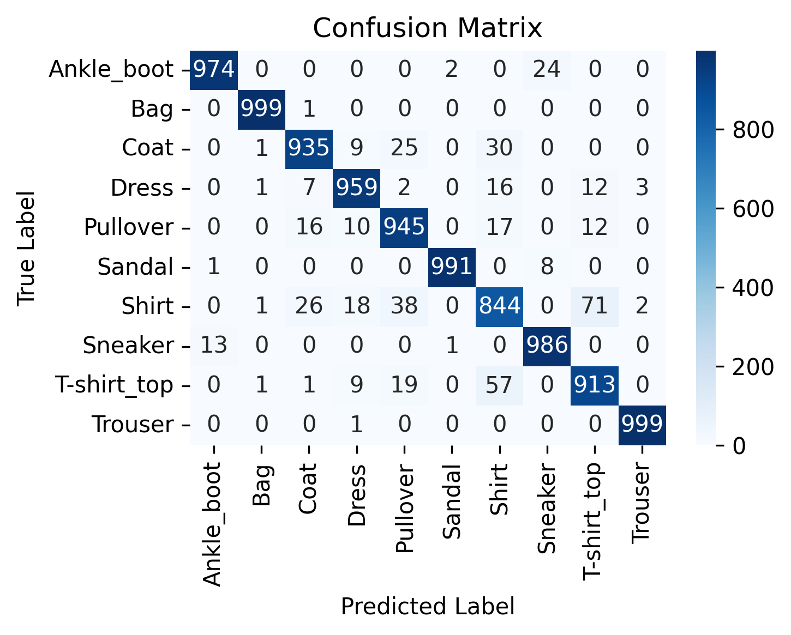
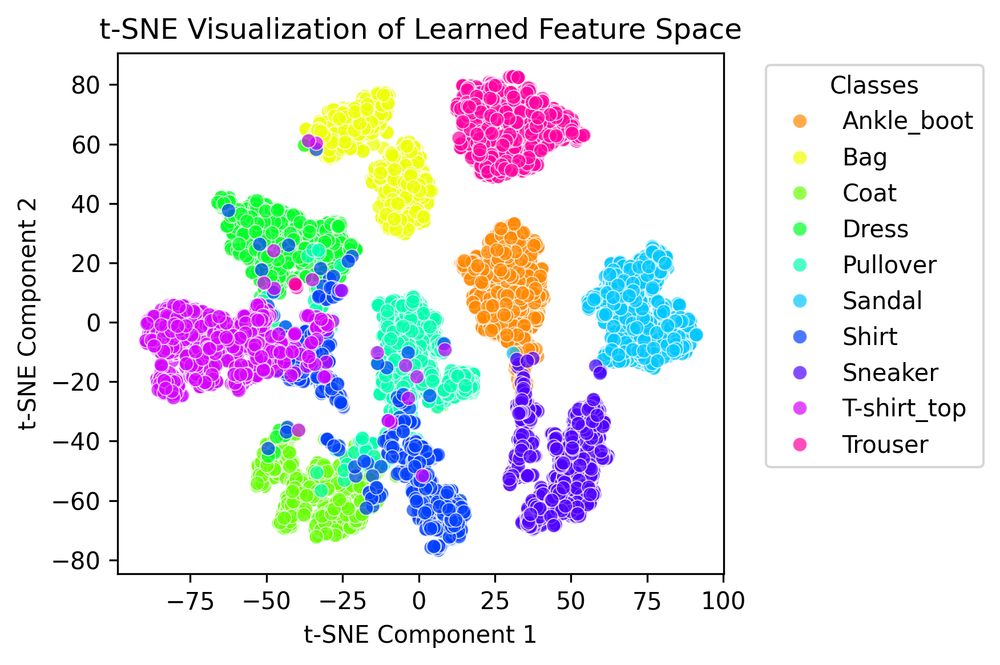

# Refund Item Classifier (Demo)

Minimal end-to-end demonstration of a batch-first ML system that classifies refunded e‑commerce items (Fashion-MNIST proxy) overnight. Focus on modular architecture, batch efficiency, confidence-driven routing, reproducibility basics.

## 1. What This Demo Shows
- Training pipeline (augmentation, SE-ResNet style model)
- Batch inference API (`Flask` + batched softmax)
- Containerization (Dockerfile) ready for a nightly job
- Lightweight CI pipeline (build + smoke tests + model hash manifest)
- Batch client & manifest writer (`scripts/run_batch_demo.py`)
- Basic reproducibility metadata (model hash, run id, confidence stats)

Intentionally NOT full production: no auth, no cloud infra templates, no full monitoring stack.

## 2. High-Level Architecture (Slide 4 Reference)
```
[Image Capture] -> [Object Storage (local data/)] -> [Scheduler (cron/GitHub Action)] ->
[Batch Container (API/Script)] -> [Output Manifest (outputs/run_*/)]
```

## 3. Quick Start
### Environment
```
python -m venv .venv
.venv\Scripts\activate   # Windows PowerShell
pip install -r requirements.txt
pip install -r api/requirements.txt
```

### Data Acquisition
```
python scripts/download_fashion_mnist.py
```
Downloads Fashion-MNIST dataset via torchvision and organizes it into the expected directory structure:
```
data/
  train/
    T-shirt_top/
    Trouser/
    ...
  test/
    T-shirt_top/
    Trouser/
    ...
```

For the full dataset (not just the demo subset), use `python scripts/download_fashion_mnist.py --full`.

### Train
```
python src/train.py
```
Model saved to `models/fashion_mnist_v1.pth`.

### Run API
```
python api/app.py
```
Server at http://127.0.0.1:5001

### Batch Demo (Slide 8)
In a second shell with API running:
```
python scripts/run_batch_demo.py
```
Outputs:
```
outputs/run_<UTC_TIMESTAMP>/
  predictions.jsonl    # one JSON doc per image
  run_metadata.json    # model hash, counts, avg confidence
```

### Sample Manifest Record
```json
{"filename": "test_000123.png", "predicted_class": "Dress", "confidence": 0.9342}
```

## 4. CI/CD (Slide 12 Simplified)
GitHub Actions workflow (`.github/workflows/ci.yml`) performs:
1. Install dependencies
2. Run smoke tests (`tests/`)
3. Build Docker image
4. Generate model artifact hash manifest (`artifact_manifest.json`)

Pipeline illustrates gating & artifact versioning concept.

## 5. Reproducibility (Slide 14)
Included:
- Versioned code (Git)
- Model weight file + SHA256 hash (CI & batch metadata)
- Batch output manifests referencing hash & run id
- Confusion matrix visualization (`Figures/confusion_matrix_fashion_mnist.png`)
- t-SNE visualization of learned embeddings (`Figures/tsne_visualization_fashion_mnist.png`)
Planned (not implemented): container digest pinning, data snapshot hash, drift reports.

## 6. Monitoring & Confidence (Slide 12 Basics)
API returns per-batch:
- `avg_confidence`
- `low_confidence_count` (threshold 0.70 inline)
Batch demo aggregates average confidence in metadata. Full production would add system + data quality metrics.

## 6.1 Model Evaluation Visualizations
Two key visualizations are included to evaluate model performance:

### Confusion Matrix


### t-SNE Visualization


The t-SNE visualization provides a 2D representation of the model's learned feature space using t-SNE dimensionality reduction.

## 7. Docker (Slide 10 Context)
Build:
```
docker build -f api/Dockerfile -t fashion-classifier-demo .
```
Run:
```
docker run -p 5001:5001 fashion-classifier-demo
```

## 8. Minimal Test Suite
`tests/test_api_smoke.py` covers:
- Root endpoint
- Error handling (empty payload)
- Single-image predict route (smoke)

## 9. Roadmap (Slide 16)
Short term:
- Add data acquisition script (download Fashion-MNIST directly)
- Align API & main requirements.txt versions
- Structured logging (JSON)
- Persist class list + preprocessing hash
Future:
- Automated nightly scheduler (GitHub Action invoking container)
- Human feedback loop & active learning queue
- Hybrid real-time lightweight model path

## 10. Repository Layout
```
api/           Flask batch inference service + Dockerfile
src/           Model, config, training & dataset utilities
analysis/      Evaluation & visualization scripts
scripts/       Utility & demo batch run script
models/        Trained weight file (placeholder)
outputs/       Generated prediction manifests (ignored until created)
Figures/       Confusion matrix and t-SNE visualizations
.github/       CI workflow (demo)
tests/         Smoke tests
```

## 11. Disclaimer
Educational demo for clarity over completeness (no auth, no retries, no distributed scaling code). Suitable as a teaching artifact aligned with the slide narrative.

**GitHub Actions Note**: This repository includes GitHub Actions workflow files for demonstration purposes only. The workflows have been moved to `.github/workflows-disabled/` to prevent them from automatically running if you fork this repository. If you want to enable them, move them back to `.github/workflows/`.
